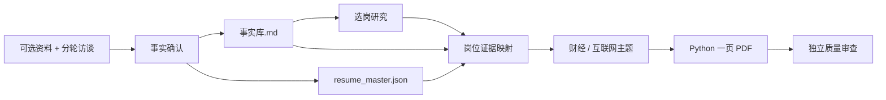

# 秋招简历 AI 定制系统

一个以“深度访谈 → 候选人事实库 → 选岗策略 → 岗位简历 → 质量审查”为主线的中文秋招工作流。它不是关键词替换器：系统先确认求职者真实做过什么、责任边界在哪里，再决定哪些岗位值得投、哪些证据应该进入简历。

仓库提供可直接使用的 Agent Skills、两套一页中文简历主题和内置示例数据。完成首次深度访谈后，系统会在本地建立候选人事实库、结构化简历母版与岗位版本简历，后续选岗、定制与自评都以这些本地文件为内容来源。

## 主要能力

- 首次使用时通过“深度访谈求职者”Skill 收集可选资料、逐段挖掘经历并核验事实；
- 建立候选人事实库，记录可用表述、责任边界、禁止项和待核验项；
- 比较同一公司的多个岗位，以机会门槛和岗位价值给出主投、次选、稳健、冲刺与不建议排序；
- 针对财经研究型或互联网业务型岗位重组证据，生成一页中文 PDF；
- 独立检查真实性、数字、时间线、岗位主线与版面；
- 用 Python + ReportLab 代替 TeX，无需安装 TeX Live。

## 快速开始

### 1. 安装

需要 Python 3.10 或更高版本，以及一款中文字体。Windows 默认优先使用 Microsoft YaHei；macOS/Linux 可安装 Noto Sans CJK，或通过环境变量指定字体。

```powershell
git clone <repository-url>
cd autumn-recruitment-resume-ai-system
python -m venv .venv
.\.venv\Scripts\Activate.ps1
pip install -r requirements.txt
```

macOS/Linux 激活环境时使用：

```bash
source .venv/bin/activate
```

### 2. 首次使用：调用深度访谈 Skill

在支持项目 Skill 的 Agent 环境中打开仓库，然后直接提出：

> 请使用 deep-interview-candidate 对我进行首次建档。我可以先提供现有简历和项目文件；请分轮访谈，不要一次问完所有问题。

Skill 会依次完成：

1. 可选资料收集与候选事实提取；
2. 围绕背景、任务、行动、结果、边界和证据的分轮访谈；
3. 生成并请你确认本地 `事实库.md`；
4. 创建本地 `resume_master.json`，并按目标岗位生成第一版简历。

如果不愿提供任何文件，可以直接口述经历。资料缺失不会阻断流程，无法确认的内容会进入待核验清单，而不会被自动补写。

### 3. 用内置示例预览两个主题

```powershell
python templates/resume_template.py `
  --input templates/sample_resume.json `
  --output output/resume_internet.pdf `
  --theme internet

python templates/resume_template.py `
  --input templates/sample_resume.json `
  --output output/resume_finance.pdf `
  --theme finance
```

macOS/Linux 将 PowerShell 的反引号续行替换为 `\`。

若系统未找到字体，可显式配置：

```powershell
$env:RESUME_FONT='C:\path\to\NotoSansCJK-Regular.ttc'
$env:RESUME_FONT_BOLD='C:\path\to\NotoSansCJK-Bold.ttc'
```

## 工作原理



### 深度访谈不是一次性问卷

系统先确认求职目标和硬约束，再按最近、最重要的经历逐段追问。每轮只提出 3—5 个紧密相关的问题，并根据回答继续深挖。例如，“负责数据分析”会被拆成：分析对象是什么、采用什么口径、个人完成哪些步骤、影响了哪个决策、结果能否归因、哪些部分由团队完成。

完成访谈的标准不是“问题问完”，而是关键经历都已确认，具备清晰的背景、任务、行动、结果和责任边界。

### 事实库记录已确认的经历

`事实库.md` 保存经过确认的个人经历，以及待核验项、冲突、禁止表述和禁止项。表达库、历史简历、JD 和网络资料都不能反向覆盖事实库。`resume_master.json` 是供渲染器读取的结构化母版，岗位版本只能选择和重组已确认事实。

`事实库.example.md` 与 `templates/sample_resume.json` 是结构与表达参考；首次访谈生成的本地文件才是候选人自己的内容来源。

### 选岗采用“机会门槛＋价值排序”

选岗 Skill 先检查硬门槛，再分别评估面试机会和面试后 Offer 转化的 A—D 档。两阶段均为 A/B 才进入“有希望”岗位池；任一阶段为 C 只能作为冲刺；硬条件未确认不能作为主投。

进入机会池后，薪资与发展各占 50%。薪资使用首年税前名义总包并拆分构成；发展综合技能资本、平台/团队、内部流动和外部退出。未知薪资不会被行业均值伪装成公司事实。

### Python 简历模板

`templates/resume_template.py` 提供两个主题：

| 主题 | 适用方向 | 版式特点 |
|---|---|---|
| `internet` | 产品、运营、商业分析、市场 | 左侧姓名与目标、右侧三行联系方式，互联网示例为 53 个非空文本行 |
| `finance` | 行业研究、投研、咨询研究 | 更紧凑的横向页眉，可选本地照片，以视觉 QA 为准 |

两者都使用 A4、约 13 mm 左右边距、中文无衬线字体、分节横线、左侧经历标题与右侧日期，并在内容超出一页时直接报错。模板不会自动缩小字号来掩盖内容过载。

输入 JSON 的最小结构：

```json
{
  "profile": {
    "name": "候选人",
    "target": "目标岗位",
    "contacts": ["电话", "邮箱", "作品链接"],
    "show_photo": false,
    "photo": ""
  },
  "sections": [
    {
      "title": "教育背景",
      "entries": [
        {
          "title": "学校",
          "subtitle": "专业｜学位",
          "date": "开始 - 结束",
          "bullets": [
            {"label": "课程与实践", "text": "经过确认的事实"}
          ]
        }
      ]
    }
  ]
}
```

## 目录结构

```text
.
├── AGENTS.md                         # 运行时路由、内容源优先级、维护护栏
├── SKILL.md                          # 简历定制工作流
├── 00_系统设计.md                     # 架构与维护说明
├── 通用硬规则.md
├── 事实库.example.md                 # 事实库结构模板（示例）
├── deep-interview-candidate/         # 首次建档与深度访谈 Skill
├── job_selection/                    # 多岗位比较 Skill
├── self_evaluation/                  # 网申自评 Skill
├── application_writing/              # 邮件与简答规范
├── agents/                           # 公司研究 Agent、质量 Reviewer
├── finance/                          # 财经研究型要求与高质量表达库
├── internet/                         # 互联网业务型要求与高质量表达库
├── templates/                        # Python 渲染器与示例 JSON
└── scripts/                          # 结构检查与发布内容检查
```

`.agents/skills/` 与 `.claude/CLAUDE.md` 是薄入口，只负责指向根目录唯一正文，不复制业务规则。

## 访谈产物

完成首次深度访谈后，系统在本地生成并持续维护：

- `事实库.md`：候选人确认过的经历、责任边界、待核验项与禁止项；
- `resume_master.json`：供渲染器读取的结构化简历母版；
- `output/`：生成的岗位简历 PDF。

对外交付前运行：

```powershell
python scripts/check_project.py
```

检查器校验项目结构与示例数据，帮助确认仓库处于可发布状态。

## 验证

```powershell
python scripts/check_project.py
python templates/resume_template.py --input templates/sample_resume.json --output output/test.pdf --theme internet
```

发布前还应确认 PDF 为一页、文本可复制、内容未截断，并人工检查文件名、PDF 元数据、联系方式和所有数字。

## 文档

| 文档 | 内容 |
|---|---|
| `AGENTS.md` | 任务路由、内容源优先级与维护护栏 |
| `00_系统设计.md` | 系统架构与设计原则 |
| `SKILL.md` | 简历定制工作流与竞争策略 |
| `deep-interview-candidate/` | 首次建档与深度访谈 |
| `job_selection/` | 同公司多岗位比较与投递优先级 |
| `self_evaluation/` | 网申自我评价与求职动机 |
| `application_writing/` | 邮件与简答题投递文案 |
| `finance/`、`internet/` | 两套领域的选材要求与高质量表达库 |
| `agents/` | 公司研究 Agent 与质量 Reviewer 角色说明 |

## 自定义

- 调整岗位语言：修改 `finance/` 或 `internet/` 中对应规范，不要把一次性 JD 关键词写成全局规则。
- 增加新领域：新增领域目录与要求文件，再在根 `SKILL.md` 增加路由。
- 调整字体：优先使用 `RESUME_FONT` / `RESUME_FONT_BOLD`，避免直接改渲染逻辑。
- 调整版式：集中修改 `THEMES` 配置，并重新生成两个示例做视觉检查。
- 增加新事实：先更新本地事实库，经确认后再更新母版和岗位简历。

## 贡献

- 新事实与可复用表达请遵循 `AGENTS.md` 维护协议，先更新承担该职责的唯一内容源，再同步相关文档。
- 提交前运行 `python scripts/check_project.py`；示例数据保持演示用途。

## 使用边界

系统无法保证面试或 Offer，也不应输出伪精确成功概率。公开录用经历只能作为观察样本；单一匿名样本、未知笔试或低置信度关键证据会限制机会等级。生成的简历仍需候选人本人确认，尤其是责任词、数字和时间。

## License

[MIT](LICENSE)
